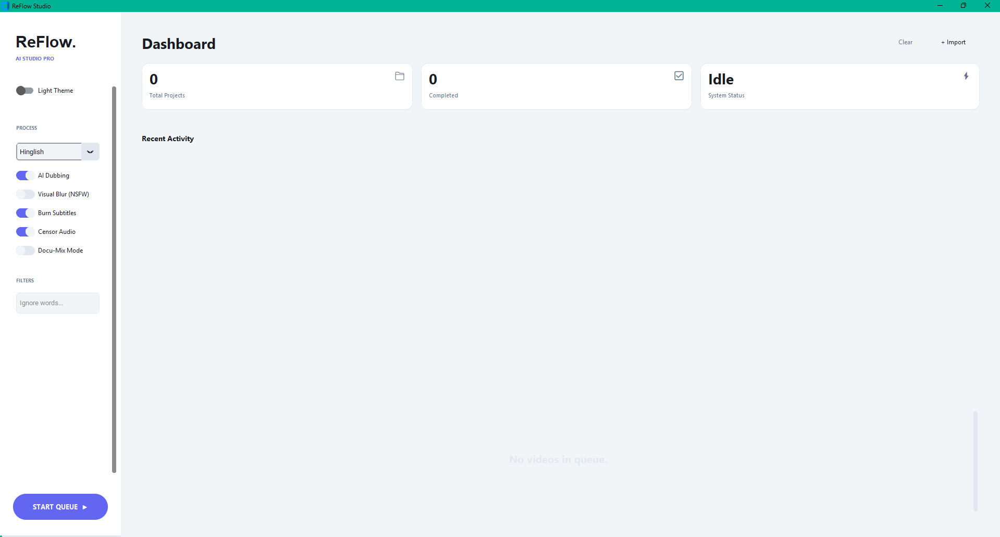
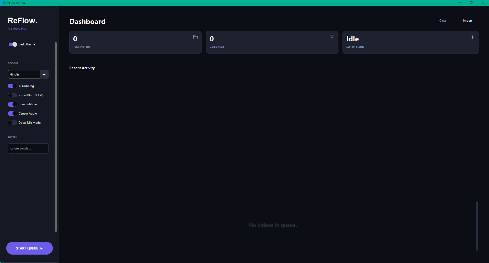

# 🎬 ReFlow Studio (v0.3.1)
### *Local AI Studio: Universal Dubbing & Visual Censorship*


**ReFlow Studio** is a powerhouse desktop suite designed to make global content accessible and family-friendly. By combining state-of-the-art Speech-to-Text, Neural TTS, and Computer Vision, ReFlow allows you to dub and censor videos entirely on your own hardware. 

---

## 💡 Why ReFlow?
Most AI tools require expensive cloud subscriptions and compromise your privacy. ReFlow is different:
* **100% Private:** No video or audio ever leaves your computer.
* **Hinglish Optimized:** Built specifically to handle the linguistic nuances of the Indian market.
* **All-in-One:** Don't use three different tools; dub, translate, and censor in one single pipeline.

---

## 📹 See it in Action
<video src="https://github.com/ananta-sj/ReFlow-Studio/raw/main/assets/Sample_Vid.mp4" width="100%" controls>
  Your browser does not support the video tag.
</video>

**✨ New in v0.3.1:** Integrated **Settings Manager**. The app now remembers your custom themes, language preferences, and hardware configurations automatically.

---

## ✨ Core Modules

### 🎙️ AI Dubbing Engine
* **Neural Transcription:** Powered by **OpenAI Whisper** for near-perfect accuracy even in noisy environments.
* **Voice Cloning (XTTS v2):** Generates natural, emotive speech that matches the original speaker's tone.
* **Docu-Mix Technology:** Professional-grade audio ducking—keep the original background track while the AI voice takes the lead.

### 🛡️ Smart Safety Suite
* **Visual Shield (NudeNet):** Real-time frame analysis to identify and blur NSFW content or gore with surgical precision.
* **Dynamic Audio Bleeping:** Automatically detects and replaces profanity with a beep or silence based on the transcript.

---

## 📥 Getting Started

### 📦 Windows Installer (Recommended)
Our **Split Installer** handles the 5GB+ AI model weights by breaking them into manageable chunks.
1. Download `ReFlow_Setup_v0.3.1.exe` and all `.bin` files from the [Releases Page](https://github.com/ananta-sj/ReFlow-Studio/releases).
2. Ensure all files are in the same folder.
3. Run the `.exe` and follow the setup wizard.


## 🛠️ Developer Setup
1.  **Clone the repository**
    ```bash
    git clone [https://github.com/ananta-sj/ReFlow.git](https://github.com/ananta-sj/ReFlow.git)
    cd ReFlow   
    ```

2.  **Install Dependencies**
    *(Note: Some AI models require specific PyTorch versions)*
    ```bash
    pip install -r requirements.txt
    ```

3. **Download required AI weights**
    ```bash
    python download_models.py
    ```

4.  **Run the App**
    ```bash
    python main.py
    ```

---

## Tech Stack & Roadmap

## 🛠️ The Tech Stack
* **UI Framework:** CustomTkinter (Modern High-DPI UI)
* **Processing:** FFmpeg (Hardware accelerated)
* **AI Inference:** ONNX Runtime & PyTorch
* **Models:** Whisper (ASR), Coqui XTTS v2 (TTS), NudeNet (CV)

---

## 🗺️ Project Roadmap
- **v0.2:** Whisper ASR integration & Hindi Translation.
- **v0.3:** NudeNet Computer Vision blurring.
- **v0.3.1:** UI Persistence & Split-Binary Installer.

---

## 🎨 Interface
| Light Theme | Dark Theme |
| :---: | :---: |
|  |  |

---

## 🤝 Contributing
ReFlow is an open-source project. Whether you are fixing bugs, adding new languages, or improving the UI, your help is welcome! 

1. Fork the Project.
2. Create your Feature Branch (`git checkout -b feature/AmazingFeature`).
3. Commit your Changes (`git commit -m 'Add some AmazingFeature'`).
4. Push to the Branch (`git push origin feature/AmazingFeature`).
5. Open a Pull Request.

---

## 📄 License
Distributed under the **MIT License**. See `LICENSE` for more information.

---
*Created with ❤️ by the ReFlow AI Team.*